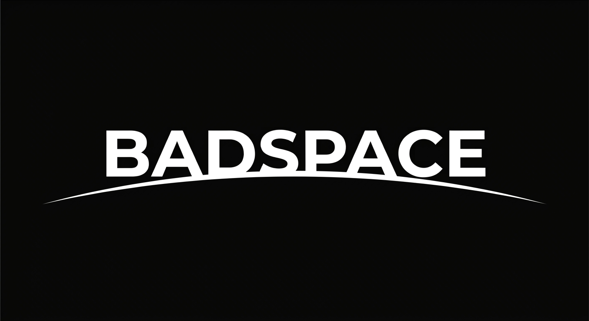

[English](README.md)

BADSPACE sarà un database real-time per entità in uno spazio 2D o 3D, pensato come base per software di simulazione, monitoraggio o gaming. Terrà traccia della posizione delle entità e risponderà a query di prossimità (range, k-nearest, raycasting) mentre migliaia di entità si muovono a ogni tick. Scalerà dividendo il mondo in partizioni che si creano e si rimuovono dinamicamente, ognuna con un solo writer.

L'obiettivo è uno strumento flessibile, che i programmatori adatteranno alle proprie esigenze invece di usarlo così com'è. Si potrà usare come libreria o come servizio, scegliere strategie di partizionamento e di clustering, e costruire sopra le sue API la propria logica applicativa. BADSPACE sarà pensato per chi non cerca un servizio già pronto, ma gli strumenti per costruire la propria soluzione.

Il progetto è in fase prototipale: il prototipo in Java (`prototype/`) serve a validare le decisioni di progetto, documentate nel [bundle OKF](okf-bundle/index.md). Stato attuale:

- **Fatto:** libreria embedded con spazi 2D e 3D, partizioni su nodi locali, indici spaziali scelti alla creazione della partizione, inserimento, lettura, aggiornamento e rimozione delle entità.
- **In corso:** commit della partizione, con un writer e più reader concorrenti sulla stessa partizione.

Licenza: [Apache 2.0](LICENSE).
